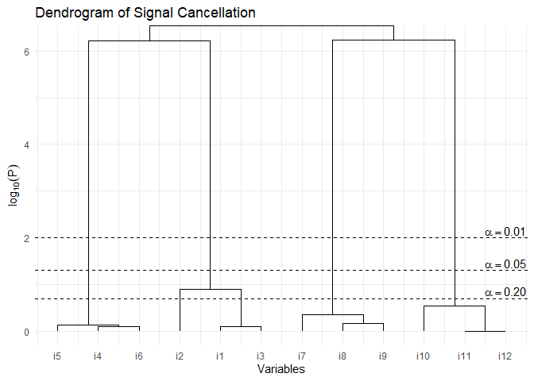

# SCFA: Signal Cancellation Factor Analysis

The library `SCFA` is an **R** implementation of the Signal Cancellation
Factor Analysis (SCFA) developped by Achim (2024, April 4). It provides
a main function `SCFA()` to carry the analysis. Currently in
development.

# Installation

The development version can be accessed through GitHub:

``` r
remotes::install_github(repo = "quantmeth/SCFA")
library(SCFA)
```

# Examples

Here is an example using the `ex_4factors_corr` correlation matrix from
the `Rnest` library (Caron, 2024). The factor structure is

<p align="center">

</p>

and the correlation matrix is

$$\begin{bmatrix}
1&.810&.270&.567&.567&.189&&&&&& \\
.810&1&.270&.567&.567&.189&&&&&& \\
.270&.270&1&.189&.189&.063&&&&&& \\
.567&.567&.189&1&.810&.270&&&&&& \\
.567&.567&.189&.810&1&.270&&&&&& \\
.189&.189&.063&.270&.270&1&&&&&& \\
&&&&&&1&.810&.270&.567&.567&.189 \\
&&&&&&.810&1&.270&.567&.567&.189 \\
&&&&&&.270&.270&1&.189&.189&.063 \\
&&&&&&.567&.567&.189&1&.810&.270 \\
&&&&&&.567&.567&.189&.810&1&.270 \\
&&&&&&.189&.189&.063&.270&.270&1 \\
\end{bmatrix}$$

From `ex_4factors_corr`, we can easily generate random data using the
`MASS` packages (Venables & Ripley, 2002).

``` r
set.seed(4)
mydata <- MASS::mvrnorm(n = 200,
                        mu = rep(0, ncol(ex_4factors_corr)),
                        Sigma = ex_4factors_corr)
```

We can then carry SCFA

``` r
output <- SCFA(mydata)
```

and the results.

``` r
# The number of factors
output
```

    ## Signal Cancellation Factor Analysis found 4 factors.

The `output` variable contains everything `SCFA()` uses to compute the
results. It will be simplified soon.

Here is the summary.

``` r
summary(output)
```

    ##  Correlations between factors: 
    ##    F1     F2     F3     F4    
    ## F1  1.000                     
    ## F2         1.000              
    ## F3         0.718  1.000       
    ## F4  0.672                1.000
    ## 
    ##  Loadings: 
    ##     F1    F2    F3    F4   
    ## i1                    0.881
    ## i2                    0.890
    ## i3                    0.356
    ## i4  0.944                  
    ## i5  0.868                  
    ## i6  0.218                  
    ## i7        0.908            
    ## i8        0.867            
    ## i9        0.268            
    ## i10             0.865      
    ## i11             0.924      
    ## i12             0.294      
    ## 
    ##   Fit indices: 
    ##      npar     chisq        df    pvalue       cfi       tli      logl       aic 
    ##    30.000    39.959    48.000     0.789     1.000     1.011 -2862.416  5784.833 
    ##       bic     rmsea      srmr 
    ##  5883.782     0.000     0.030

Here is the dendrogram.

``` r
plot(output)
```



Even though `SCFA` did not retrieve the denominatively same factors,
population `F1` is sample `F4`, `F2` is `F1`, `F3` is `F2`, and `F4` is
`F3`, respectively, the very same patterns are found among the items,
even for this very difficult to determine dimensionality correlation
matrix.

<!-- We can visualize the results using the generic function `plot()`. -->
<!-- ```{r plot, fig.cap="Scree plot of NEST", imgcenter='center'} -->
<!-- res <- nest(mydata) -->
<!-- plot(res) -->
<!-- ``` -->
<!-- The above figure shows the empirical eigenvalues in blue and the 95^th^ percentile of the sampled eigenvalues. -->
<!-- It is also possible to use a correlation matrix directly. A sample size, `n` must be supplied. -->
<!-- ```{r nest2} -->
<!-- nest(ex_4factors_corr, n = 240) -->
<!-- ``` -->
<!-- The `nest()` function can use with many $\alpha$ values if desired. -->
<!-- ```{r plot2, fig.cap="Scree plot of NEST with many $\\alpha$", imgcenter='center'} -->
<!-- res <- nest(ex_4factors_corr, n = 120, alpha = c(.01,.025,.05,.1)) -->
<!-- plot(res) -->
<!-- ``` -->

# How to cite

Caron, P.-O. (2024). *SCFA: Signal Cancellation Factor Analysis*.
<https://github.com/quantmeth/SCFA>

# References

<div id="refs" class="references csl-bib-body hanging-indent"
line-spacing="2">

<div id="ref-Achim24" class="csl-entry">

Achim, A. (2024, April 4). Signal cancellation factor analysis.
*PsyArXiv*, 1–13. <https://doi.org/10.31234/osf.io/h7qwg>

</div>

<div id="ref-Caron24" class="csl-entry">

Caron, P.-O. (2024). *Rnest : An R package for the Next Eigenvalue
Sufficiency Tests (NEST)*. <https://github.com/quantmeth/Rnest>

</div>

<div id="ref-MASS" class="csl-entry">

Venables, W. N., & Ripley, B. D. (2002). *Modern applied statistics with
S*. Springer. <https://www.stats.ox.ac.uk/pub/MASS4/>

</div>

</div>
